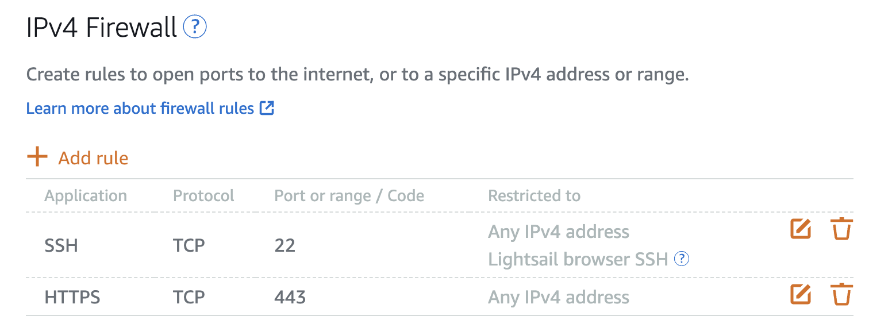

# Jun 13

- Chose AWS Lightsail because it is simple and works like a normal VPS.
- AWS Lightsail was planned as the main VPN node.
- Picked Singapore region because it was easier than Hong Kong setup.
- Used Ubuntu 24.04 LTS because it has lots of tutorials.
- Opened port `443` for the VPN traffic.



- Made a setup folder:

```bash
mkdir -p ~/xray-setup
cd ~/xray-setup
```

- Installed Xray and used VLESS + REALITY.
- Imported the client config into Shadowrocket.
- Text apps worked first, but YouTube and uploads were not stable.
- Fix was adding the correct server name/SNI in the client config.

