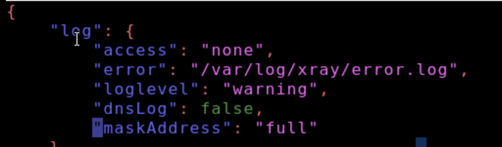
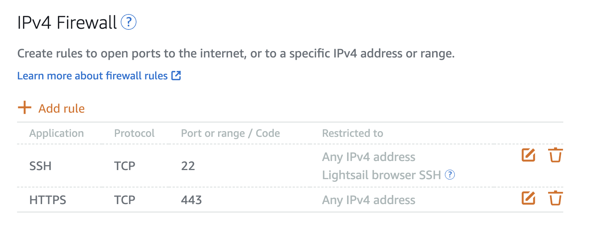

# Jun 15

- Changed Xray logging so access logs are off.
- Kept error logs only for debugging.

- Cleared old logs with `truncate`.
- Checked system journal with `journalctl`.
- AWS firewall was limited to SSH and `443`.

- IPv6 was disabled because the VPN setup only needed IPv4.
- Found that testing while another VPN was connected can cause weird timeout problems.

