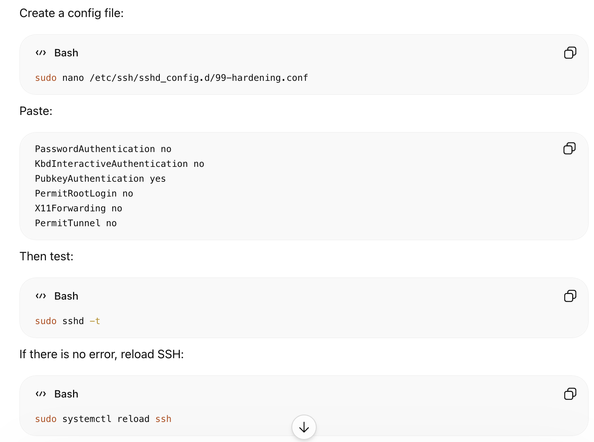

# Jun 21

- Added Fail2ban.
- Checked Ubuntu firewall.
- Tried DNS content blocker.
- Did SSH hardening.

- Added Docker log rotation so logs do not grow too big.
- These security notes apply to the RackNerd panel VPS and the AWS/Bandwagon node VPSs.

